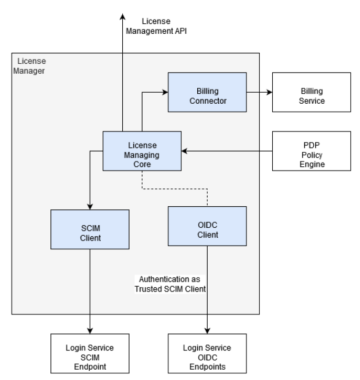

[[mainOverview]]
= Overview

== Building Block Overview

[NOTE]
.Content Description
================================
This section contains:

* High-Level Description of the Building Block
* Context within EOEPCA
================================

The functionality of the License Manager will mainly be as support for the PDP Policy Engine when assessing policy checks that directly 
relate to Licenses owned by the Platform or by the End-User requesting access to a specific resource.

* Licence Managing Core, with the capability of recording which Licenses an End-User has available and
whether or not the limits applied to that license have been reached (i.e. if more than 5 users are
concurrently using a service with the same License key, a PDP request for Authorization could be
turned down).
* SCIM Client, allowing to retrieve user information that is local to the platform, whenever possible or to update User Profiles based on the
assignment of a specific license
* OIDC Client, allowing to authenticate the component as trusted within the architecture and used by the License Manager to identify itself as trusted party within the EP domain in
order to able to perform queries against the Login Service SCIM endpoints.
* Billing Connector allowing the generation of charging requests to the Billing Service, either timebased or volume-based.
* Management API for License Owners to register Licenses into the system and to assign licenses to the Platform to specific End-Users

=== Initialization flow

The figure below, identifies the main workflows on which the License Manager participates, along with it's components:

=== Exposed Interfaces

==== Licenses API

The API will be the platform where the owners will access in order to actually manage the licenses in use. For that an special credentials are needed since not every user has access, same as the login-service.

==== User Profile

In the User Profile web interface each user has access to their own license list stored into the login service user information endpoint. In order to retrieve that values it reuses the SCIM library of EOEPCA.

=== Consumed Interfaces

==== OIDC (to Login Service) 

The PDP uses the OIDC protocol in order to authenticate itself as a valid UMA client, and uses this OIDC client in all UMA-related queries.It allows Clients to verify the identity of the End-User. (https://gluu.org/docs/gluu-server/4.0/admin-guide/openid-connect/)

These queries are done against the Login Service, and the endpoints used are:

* Discovery Endpoint: /.well-known/openid-configuration

And the keys used from Well Known Handler:

* Token Endpoint: KEY_OIDC_TOKEN_ENDPOINT
* UserInfo Endpoint: KEY_OIDC_USERINFO_ENDPOINT

==== SCIM (to Login Service)

The PDP has the capability to auto-register itself as a client if there is no client pre-configured from previous starts or previous configuration. In order to do this, it utilizes the SCIM protocol which is designed to reduce the complexity of user management operations. (https://gluu.org/docs/gluu-server/3.1.1/user-management/scim2/)

The keys used from Well Known Handler:

* User Atributes: KEY_SCIM_USER_ENDPOINT
* Private Key JWT Key: ENDPOINT_AUTH_CLIENT_PRIVATE_KEY_JWT

== Required resources

[NOTE]
.Content Description
================================
This section contains:

* List of HW and SW required resources for the correct functioning of the building Block
* References to open repositories (when applicable)

================================

=== Interdependencies

The following list organizes main identified features based on inter-dependencies and impact on the
overall reference implementation functionality:

* UM-LIM-010: SCIM Client connection to License Manager
* UM-LIM-020: OIDC Client connection to License Manager
* UM-LIM-030: License Manage Core (Use Cases)
* UM-LIM-040: Billing Connector
* UM-LIM-050: License Management API

=== Software

The following Open-Source Software is required to support the deployment and integration of the Policy Enforcement Point:

* EOEPCA's SCIM Client - https://github.com/EOEPCA/um-common-scim-client
* EOEPCA's OpenID - https://github.com/EOEPCA/um-common-oidc-client
* EOEPCA's Well Known Handler - https://github.com/EOEPCA/well-known-handler

== Use cases

=== Owner Run Operation
In this case the owner interacts with the API in order to operate against the licenses. This secuential diagram shows the different components the Building Block manages.

[.text-center]
[#img_license_case1,reftext='{figure-caption} {counter:figure-num}']
.Owner Operation Case
[plantuml, license_case1, png] 
....
include::include/license_case1.wsd[]
....

=== End User access to a Resource protected with Licenses

The interaction within the system can be shown in the following diagram that illustrates how the end user activates a license check when accessing a resource through the PEP and PDP

[.text-center]
[#img_license_case2,reftext='{figure-caption} {counter:figure-num}']
.Owner Operation Case
[plantuml, license_case2, png] 
....
include::include/license_case2.wsd[]
....

=== End User Licenese management through the User Profile

The User Profile offers an interface to manually edit the user attributes, in specific the Licenses associated.
The next diagram will show that interaction:

[.text-center]
[#img_license_case3,reftext='{figure-caption} {counter:figure-num}']
.Owner Operation Case
[plantuml, license_case3, png] 
....
include::include/license_case3.wsd[]
....
